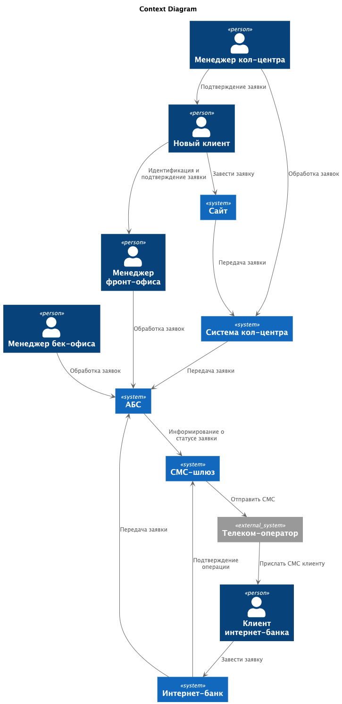
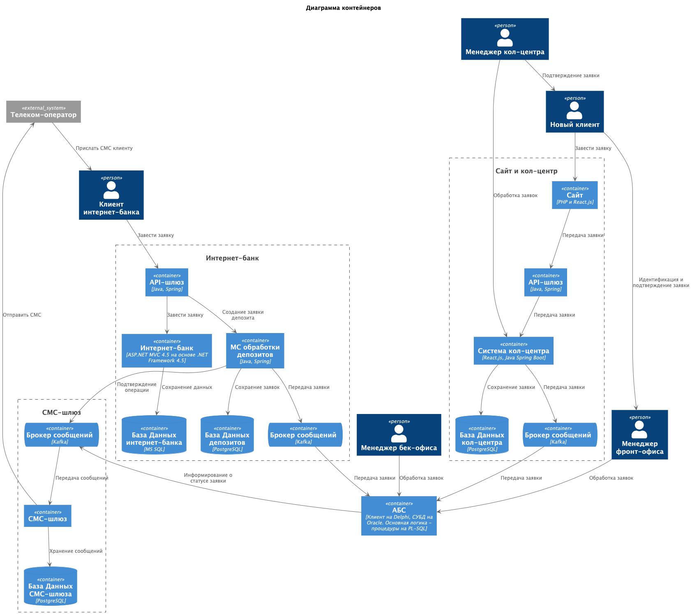

### **Название задачи:** Открытие депозитов онлайн

### **Автор:** Дементьев Аркадий

### **Дата:** 25.10.2025

### **Функциональные требования**

Опишите здесь верхнеуровневые Use Cases. Их нужно оформить в виде таблицы с пошаговым описанием:

| **№** | **Действующие лица или системы**                                       | **Use Case**                           | **Описание**                                                                                                                                                                                                                                                                                                                     |
|:-----:|:-----------------------------------------------------------------------|:---------------------------------------|:---------------------------------------------------------------------------------------------------------------------------------------------------------------------------------------------------------------------------------------------------------------------------------------------------------------------------------|
|   1   | Клиент  Сайт   Система кол-центра                              | Подача заявки через сайт               | 1.Клиент на сайте открывает список доступных депозитов.   2. Клиент выбирает депозит.  3.Клиент заполняет заявку, указывает свой номер телефона и Ф.И.О   3.Заявка с сайта попадает в систему Кол-центра в зашифрованном виде.                                                                                       |
|   2   | Менеджер Кол-центра  Система кол-центра  Клиент                | Обработка заявки в кол-центре          | 1.Менеджеру Кол-центра получает новые заявки в системе кол-центра.  2.Менеджеру выбирает заявку и формирует предложение для клиента.  3.Менеджер звонит клиенту для подтверждения заявки.  4.Заявка передается в АБС                                                                                                 |
|   3   | Клиент  Менеджер фронт-офиса  Менеджер бек-офиса  АБС  | Подтверждение заявки в отделении       | 1.Клиент приходит в отделение для идентификации.  2.Менеджер фронт-офиса открывает заявку в АБС, идентифицирует клиента и отправляет заявку на подтвержение менеджеру бек-офиса.  3.Менеджер бек-офиса сверяется с актуальными ставками в АБС и подтверждает заявку.  4.Менеджер фронт-офиса передает данные клиенту |
|   4   | Клиент  Интернет-банк  АБС                                     | Подача заявки через интернет-банк      | 1.Клиент в интернет-банке открывает список доступных депозитов и персонализированные предложения.  2.Клиент выбирает депозит  3.Клиент заполняет заявку, указывает счёт и сумму депозита.  4.Клиенту приходит СМС для подтверждения действия   5.Заявка из интернет-банка попадает в АБС в зашифрованном виде.   |
|   5   | Менеджер бек-офиса  Клиент  АБС                                | Подтверждение заявка из интернет-банка | 1.Менеджер бек-офиса в АБС открывает список заявок на подтверждение.  2.Менеджер сверяет условия по заявке с актуальной информаций по ставкам в АБС.  3.Менеджер подтверждает заявку.  4.Клиенту приходит СМС о подтверждении заявки                                                                                 |

### **Нефункциональные требования**

Опишите здесь нефункциональные требования и архитектурно значимые требования.

| **№** | **Требование**                                                                                                                                               |
|:-----:|:-------------------------------------------------------------------------------------------------------------------------------------------------------------|
|   R   | **Надёжность (Reliability)**                                                                                                                                 |
|  R1   | Все сервисы должны работать 24/7                                                                                                                             |
|  R2   | Доступность - 99,9%                                                                                                                                          |
|   P   | **Производительность (Performance)**                                                                                                                         |
|  P1   | Отклик по всем операциям должен быть максимально быстрым и занимать миллисекунды                                                                             |
|  P2   | Необходимо предусмотреть равномерное горизонтальное масштабирование и распределение запросов между серверами, приложениями и ЦОД                             |
|  +R   | **+ Ограничения (Restrictions)**                                                                                                                             |                                                                                                                                                                                                               
|  R1   | Сайт - собственная разработка банка на PHP и React.js                                                                                                        |                                                                                                                                                                                                               
|  R2   | Интернет-банк - клиент-серверная система на веб-фреймворке ASP.NET MVC 4.5 на основе .NET Framework 4.5 и СУБД MS SQL                                        |                                                                                                                                                                                                               
|  R3   | АБС. Интерфейс пользователей — это десктопный клиент на Delphi и СУБД на Oracle. Основная логика - процедуры на PL-SQL в СУБД                                |                                                                                                                                                                                                               
|  R4   | Система кол-центра - веб-интерфейс на React.js, бэкенд на Java Spring Boot и базы PostgreSQL                                                                 |                                                                                                                                                                                                               
|  R5   | Реализовываем функционал работы с СМС силами команды разработки банка                                                                                        |                                                                                         
|  R6   | Для очереди сообщений использовать Kafka                                                                                                                     | 
|  R7   | Необходимо учесть, что некоторые справочные данные загружаются больше секунды                                                                                |                                                                                                                                                                                                               
|  R8   | База данных системы АБС перегружена. Онлайн-подача заявок на большое количество продуктов может поставить под угрозу работоспособность банка                 |                                                                                                                                                                                                               
|  R9   | Необходимо избежать прямой работы интернет-банка с API АБС                                                                                                   |                                                                                                                                                                                                               
|  R10  | АБС может масштабироваться только вертикально из-за своей базы данных                                                                                        |                                                                                                                                                                                                              

### **Решение**

Приведите диаграммы контекста и контейнеров в модели C4. Опишите там основные компоненты и интеграции всех элементов
решения.

Для передачи заявок в АБС используем брокер сообщений Kafka, как из интернет-банка, так и через кол-центр.
Это обеспечит выполнение требования R6, R9, а также R8, так как в онлайн подача заявок будет идти через очередь, 
а следовательно не перегрузит АБС.

Доступ в интернет-банг делаем через шлюз, который может выступать также и балансировщиком, и выделяем
отдельный сервис для обработки депозитных заявок с отдельной БД, это даст возможность дополнительного масштабирования,
и позволит выполнить требования надежности и производительности системы.

Для СМС-шлюза вводим БД, для хранения сообщений и статусов отправки, а также вводим перед смс-шлюзом очередь сообщений,
что позволит убрать лишние зависимости и повысить надежность системы.

Для заведения заявок с сайта также вводим дополнительный api-шлюз, он может выступить как балансировщиком, так и повысить безовпасность.

### **Альтернативы**

1. Для интернет-банка можно отказаться от реализации отдельного сервиса Депозитов, сделать взамодействие с кафкой в основной системе.

**Недостатки, ограничения, риски**

1. АБС - является основной монолитной системой банка, а значит и узким местом. В будущем это может создать трудности
для повышения нагрузки и увеличения клиентской базы банка.
2. Все новые Сервисы и шлюзы будут выполнены на Java стеке, не все сотрудники ИТ с ним знакомы.
