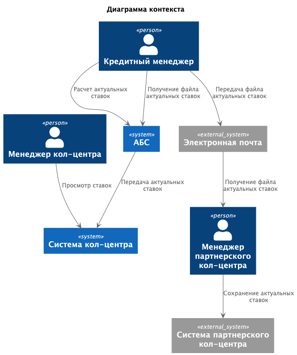
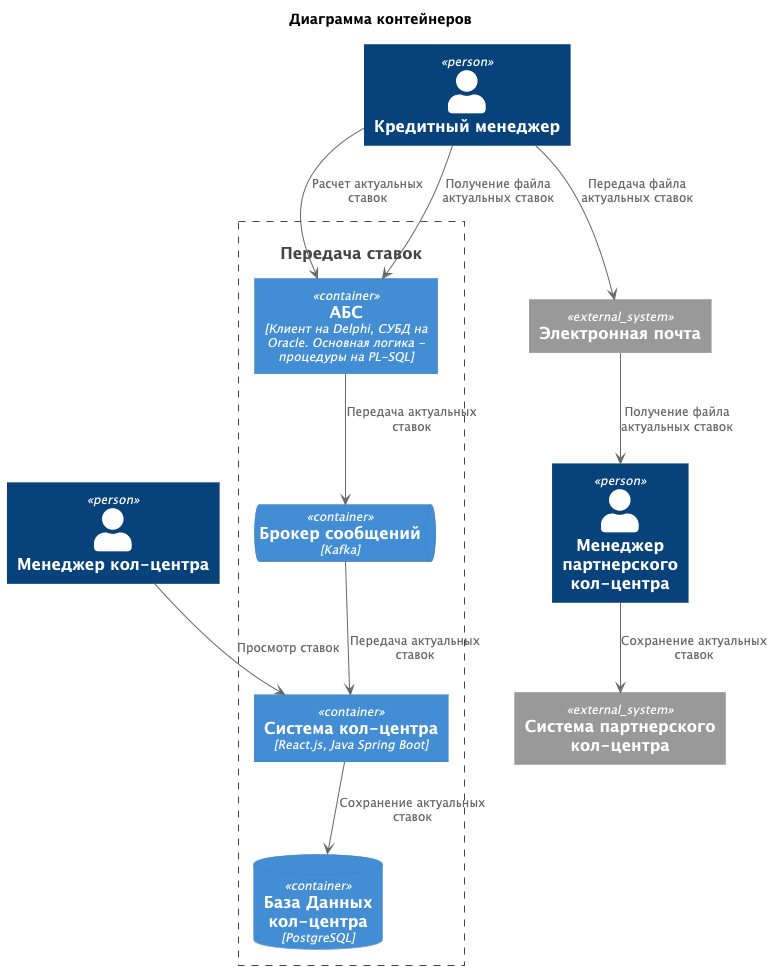

### **Название задачи:** Передача ставок в кол-центр

### **Автор:** Дементьев Аркадий

### **Дата:** 25.10.2025

### **Функциональные требования**

Опишите здесь верхнеуровневые Use Cases. Их нужно оформить в виде таблицы с пошаговым описанием:

| **№** | **Действующие лица или системы**                                  | **Use Case**                            | **Описание**                                                                                                                                                                                                                                                                                                                                                                                                  |
|:-----:|:------------------------------------------------------------------|:----------------------------------------|:--------------------------------------------------------------------------------------------------------------------------------------------------------------------------------------------------------------------------------------------------------------------------------------------------------------------------------------------------------------------------------------------------------------|
|   1   | Кредитный менеджер  АБС                                       | Формирование актуальных ставок          | 1.Кредитный менеджер получает актуальную информацию о ставке ЦБ, текущее количество выданных кредитов и депозитов в банке.  2.Сотрудник вносит информацию в АБС.  3.На основании полученных данных производится расчет актуальных ставок по депозитам.  4.Сотрудник, при необходимости, может поменять рассчитанную информацию, далее подтверждает актуальный список ставок.                      |
|   2   | АБС  Система кол-центра  Менеджер кол-центра              | Передача ставок в колл-центр            | 1.После подтверждения актуального списка ставок система АБС инициализирует отправку ставок через брокер сообщений.  2.Система кол-центра вычитывает актуальный список ставок из очереди.  3.Список сохраняется в БД системы кол-центра для дальнейшего отображения сотрудникам кол-центра.  4.Менеджер кол-центра может посмотреть актуальные списки в соответствующем разделе системы кол-центра |
|   3   | АБС  Кредитный менеджер  Менеджер партнерского кол-центра | Передача ставок в кол-центр подрядчиков | 1.После подтверждения актуального списка ставок сотрудник скачивает список из системы АБС в формате XLS.  2.Сотрудник отправляет файл по почте ответственному менеджеру партнерского кол-центра.  3.Менеджер рассылает файл сотрудникам кол-центра по работе с клиентами или вносит данные в систему партнерского кол-центра.                                                                         |

### **Нефункциональные требования**

Опишите здесь нефункциональные требования и архитектурно значимые требования.

| Код | Требования                                                                                                                       | Комментарий |
|-----|----------------------------------------------------------------------------------------------------------------------------------|-------------|
| F   | **Функциональные (Functionality)**                                                                                               |             |
| F1  | Сотрудники бэк-офиса депозитов и бэк-офиса кредитов должны иметь возможность работать со ставками по депозитам в АБС             |             |
| F2  | Сотрудники кол-центра должны иметь возможность работать с актуальными ставками по депозитам в системе кол-центра                 |             |
| F3  | Сотрудники партнерского кол центра должны иметь возможность работать с актуальными ставками по депозитам                         |             |
| R   | **Надёжность (Reliability)**                                                                                                     |             |
| R1  | Все сервисы должны работать 24/7                                                                                                 |             |
| R2  | В случае сбоев в ЦОД необходимо, чтобы сервисы интернет-банка были доступны и выдерживали требуемую нагрузку                     |             |
| P   | **Производительность (Performance)**                                                                                             |             |
| P1  | Необходимо предусмотреть равномерное горизонтальное масштабирование и распределение запросов между серверами, приложениями и ЦОД |             |
| +R  | **+ Ограничения (Restrictions)**                                                                                                 |             |
| R1  | АБС. Интерфейс пользователей — это десктопный клиент на Delphi и СУБД на Oracle. Основная логика - процедуры на PL-SQL в СУБД    |             |
| R2  | Система кол-центра - веб-интерфейс на React.js, бэкенд на Java Spring Boot и базы PostgreSQL                                     |             |
| R3  | Для очереди сообщений использовать Kafka                                                                                         |             |
| R4  | Кол-центр партнёра работает во внешней информационной системе относительно банка. Нет возможности сделать API-вызовы             |             |

### **Решение**

Приведите диаграммы контекста и контейнеров в модели C4. Опишите там основные компоненты и интеграции всех элементов
решения.

Для ускорения и автоматизации процесс расчета ставок делаем в АБС, кредитному менеджеру останется только занести 
информацию об актуальных ставках ЦБ и другую необходимую информацию. Для передачи списка ставок через почту
предусмотрена функция скачивания списка ставок в формате XLS.

Для передачи ставок из АБС в систему кол-центра будет использовать брокер сообщений, это уберет лишние зависимости, 
предотвратит потерю информации в случае сбоев и недоступности.

Актуальны список ставок сохраним в БД системы кол-центра. Это позволит сотрудникам иметь доступ к ставкам при необходимости.

### **Альтернативы**

1. В качестве альтернативы можно оставить текущий процесс ручного расчета ставок полностью на кредитном менеджере.
После расчета менеджер может загрузить файл в АБС, а также передать по почте в партнерский кол-центр.

**Недостатки, ограничения, риски**

1. Передача информации в партнерский кол-центр в ручную сопряжена с рисками и человеческим фактором.

