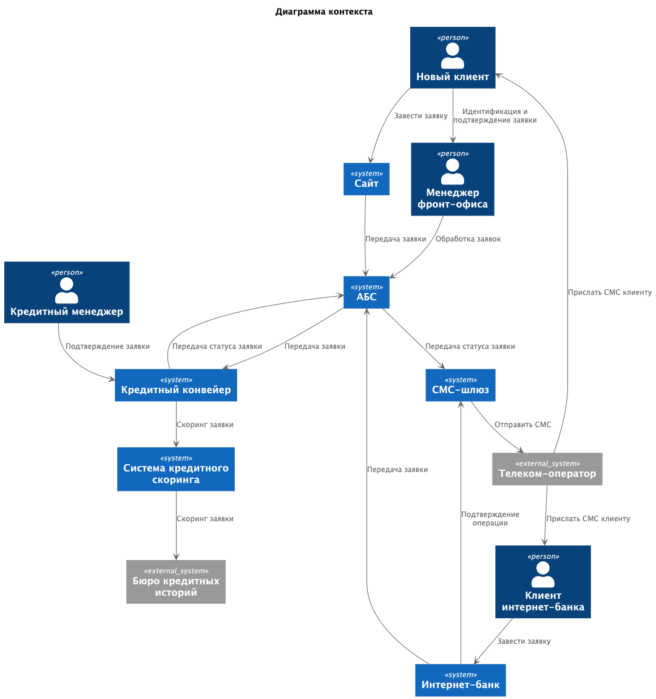
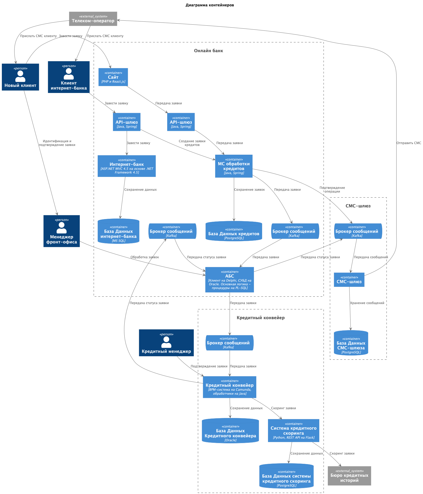

### **Название задачи:** Заявка на кредит онлайн

### **Автор:** Дементьев Аркадий

### **Дата:** 25.10.2025

### **Функциональные требования**

Опишите здесь верхнеуровневые Use Cases. Их нужно оформить в виде таблицы с пошаговым описанием:

| **№** | **Действующие лица или системы**                                                                         | **Use Case**                      | **Описание**                                                                                                                                                                                                                                                                                                                                                                                                                                                                                |
|:-----:|:---------------------------------------------------------------------------------------------------------|:----------------------------------|:--------------------------------------------------------------------------------------------------------------------------------------------------------------------------------------------------------------------------------------------------------------------------------------------------------------------------------------------------------------------------------------------------------------------------------------------------------------------------------------------|
|   1   | Клиент  Кредитный менеджер  Сайт  АБС  Кредитный конвейер  Система скоринга          | Подача заявки через сайт          | 1.Клиент на сайте открывает список доступных кредитов.   2. Клиент выбирает кредит.  3.Клиент заполняет заявку, указывает свой номер телефона, Ф.И.О, паспортные данные   4.Заявка направляется в АБС.  5.Заявка попадает в Кредитный конвейер.  6.Выполняется скоринг в системе скоринга.  7.Кредитный менеджер производит предварительное подтверждение заявки.   8.Клиент получает СМС об одобрении и приглашении прийти в банк для идентификации            |
|   2   | Клиент  Менеджер фронт-офиса  Кридтный менеджер  АБС  Кредитный конвейер                 | Подтверждение заявки в отделении  | 1.Клиент приходит в отделение для идентификации.  2.Менеджер фронт-офиса открывает заявку в АБС, идентифицирует клиента и отправляет заявку на подтверждение Кредитному менеджеру.  3.Кредитный менеджер сверяет информацию и подтверждает заявку.  4.Менеджер фронт-офиса передает данные клиенту                                                                                                                                                                              |
|   3   | Клиент  Кредитный менеджер  Интернет-банк  АБС  Кредитный конвейер  Система скоринга | Подача заявки через интернет-банк | 1.Клиент на сайте открывает список доступных и предодобренных кредитов.   2. Клиент выбирает кредит.  3.Клиент заполняет заявку, указывает счёт зачисления средств и данные для подачи заявки.  4.Операция на подачу заявки на кредит подтверждается СМС-кодом.  5.Заявка направляется в АБС.  6.Заявка попадает в Кредитный конвеер для повторного скоринга.  7.Кредитный менеджер подтверждает заявку.  8.Клиент получает СМС уведомление о выполнении заявки |

### **Нефункциональные требования**

Опишите здесь нефункциональные требования и архитектурно значимые требования.

| Код | Требования                                                                                                                                                                                                    | Комментарий |
|-----|---------------------------------------------------------------------------------------------------------------------------------------------------------------------------------------------------------------|-------------|
| F   | **Функциональные (Functionality)**                                                                                                                                                                            |             |
| F1  | Клиент на сайте может просмотреть предложение по открытию кредита по некоторой ставке                                                                                                                         |             |
| F2  | Клиент на сайте может подать заявку на кредит, оставив свой номер телефона и Ф. И. О. Если клиент ещё заполнит паспортные данные, то необходимо сразу выдать решение об одобрении или неодобрении ему кредита |             |
| F3  | Для выполнения заявки по кредиту, новый клиент должен получить СМС и после прийти в отделение для получения кредита и идентификации                                                                           |             |
| F4  | Менеджер в отделении должен иметь возможность работать с заявками, которые клиент подал заранее через сайт                                                                                                    |             |
| F5  | Клиент в интернет-банке может просмотреть предложение по открытию кредита с актуальными условиями и предодобренные предложения по кредиту                                                                     |             |
| F6  | По клиентам периодически должен производится скоринг и рассчитывается приемлемая сумма кредита для формирования предодобренных предложений                                                                    |             |
| F7  | Клиент в интернет-банке может выбрать предодобренную заявку, указать счёт зачисления средств и данные для подачи заявки, и отправить её в банк                                                                |             |
| F8  | Операция на подачу заявки через интернет-банк на кредит должны подтверждаться СМС-кодом                                                                                                                       |             |
| F9  | Предодобренные заявки должны оперативно попадать в Кредитный конвейер из АБС, чтобы сотрудники обрабатывали их в течение того же рабочего дня                                                                 |             |
| F10 | Необходимо добавить информирование клиента по СМС об изменении статуса заявки на кредит.                                                                                                                      |             |
|     |                                                                                                                                                                                                               |             |
| U   | **Удобство использования (Usability)**                                                                                                                                                                        |             |
| U1  | Интерфейс должен соответствовать системе дизайна, которая принята в компании                                                                                                                                  |             |
| R   | **Надёжность (Reliability)**                                                                                                                                                                                  |             |
| R1  | Все сервисы должны работать 24/7                                                                                                                                                                              |             |
| R2  | Доступность - 99,9%                                                                                                                                                                                           |             |
| R3  | В случае сбоев в ЦОД необходимо, чтобы сервисы интернет-банка были доступны и выдерживали требуемую нагрузку                                                                                                  |             |
| P   | **Производительность (Performance)**                                                                                                                                                                          |             |
| P1  | Отклик по всем операциям должен быть максимально быстрым и занимать миллисекунды                                                                                                                              |             |
| P2  | Необходимо предусмотреть равномерное горизонтальное масштабирование и распределение запросов между серверами, приложениями и ЦОД                                                                              |             |
| +R  | **+ Ограничения (Restrictions)**                                                                                                                                                                              |             |
| R1  | Сайт - собственная разработка банка на PHP и React.js                                                                                                                                                         |             |
| R2  | Интернет-банк - клиент-серверная система на веб-фреймворке ASP.NET MVC 4.5 на основе .NET Framework 4.5 и СУБД MS SQL                                                                                         |             |
| R3  | АБС. Интерфейс пользователей — это десктопный клиент на Delphi и СУБД на Oracle. Основная логика - процедуры на PL-SQL в СУБД                                                                                 |             |
| R4  | Реализовываем функционал работы с СМС силами команды разработки банка                                                                                                                                         |             |
| R5  | Для очереди сообщений использовать Kafka                                                                                                                                                                      |             |
| R6  | Необходимо учесть, что некоторые справочные данные загружаются больше секунды                                                                                                                                 |             |
| R7  | База данных системы АБС перегружена. Онлайн-подача заявок на большое количество продуктов может поставить под угрозу работоспособность банка                                                                  |             |
| R8  | Необходимо избежать прямой работы интернет-банка с API АБС                                                                                                                                                    |             |
| R9  | АБС может масштабироваться только вертикально из-за своей базы данных                                                                                                                                         |             |
| R10 | Заявки попадают в Кредитный конвейер раз в сутки из АБС. При этом ускорить обмен между базами и проводить его чаще невозможно                                                                                 |             |
| R11 | Кредитный конвейер и система кредитного скоринга разработаны с учётом возможного роста нагрузки и поддерживают горизонтальное масштабирование с работой 24/7                                                  |             |
| R12 | Система кредитного скоринга испытывает повышенную нагрузку в рабочие часы, её не нужно нагружать дополнительными процессами по предрасчетам скорингов                                                         |             |

### **Решение**

Приведите диаграммы контекста и контейнеров в модели C4. Опишите там основные компоненты и интеграции всех элементов
решения.

Для передачи заявок в АБС используем брокер сообщений Kafka, как из интернет-банка, так и через кол-центр.
Это обеспечит выполнение требования R5, R8, а также R7, так как в онлайн подача заявок будет идти через очередь,
а следовательно АБС может обрабатывать сообщения из очереди с приемлемой для системы скоростью.

Доступ в интернет-банк делаем через шлюз, который может выступать также и балансировщиком, и выделяем
отдельный сервис для обработки кредитных заявок с отдельной БД, это даст возможность дополнительного масштабирования,
и позволит выполнить требования надежности и производительности системы.

Для отправки в кредитный конвейер также вводим очередь сообщений. С помощью очереди, убираем ежедневную синхронизацию
и передачу заявок из АБС с помощью БД, и делаем отправку сразу, как только она поступила в АБС.
Передачу статуса заявки обратно в АБС также делаем через очередь.

Для СМС-шлюза вводим БД, для хранения сообщений и статусов отправки, а также вводим перед смс-шлюзом очередь сообщений,
что позволит убрать лишние зависимости и повысить надежность системы.

Для заведения заявок с сайта также вводим дополнительный api-шлюз, он может выступить как балансировщиком, так и
повысить безопасность.

### **Альтернативы**

1. Для интернет-банка можно отказаться от реализации отдельного сервиса Кредитов, сделать взаимодействие с кафкой и
   СМС шлюзом в основной системе интернет-банка.

**Недостатки, ограничения, риски**

1. АБС - является основной монолитной системой банка, а значит и узким местом. В будущем это может создать трудности
   для повышения нагрузки и увеличения клиентской базы банка.
2. Все новые Сервисы и шлюзы будут выполнены на Java стеке, не все сотрудники ИТ с ним знакомы.

